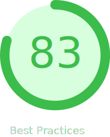

##### About Me

I’m Sami Capaldi, a Frontend Developer based in Manchester. I have over 12 years design & development experience in freelance, agency and in-house, covering B2B and B2C.

I have a strong eye for detail, delivering solid results from the initial pitch through to the final product.

Alongside frontend development, I am also a Certified Adobe Professional and Email Marketing expert.

My longterm career goal is to move into a more fullstack role.

---

##### Recent Projects

[Thameen London](https://www.thameenlondon.com) 

Headless e-commerce site using Shopify Hydrogen, Vite, Tailwind and SwiperJS

Performance Metrics

  
  
  
  

[Tribus Digital](https://www.tribusdigital.com) 

Company website and Blog build using Statamic, GreenSock, Vite and Vanilla JS

  
Performance Metrics

  

    
    
    
    
  

[Lenvi](https://www.lenvi.com) 

Website built using HTML, SASS, Vanilla JS & Bootstrap

Performance Metrics

  
  
  
  

[MiProject Suite](https://www.miproject.org/hub/index.php) 

Contributed to frontend for MiProject software suite built using VueJS, Twig and Bootstrap. As well as developing the product Hub pages using PHP, HTML, SCSS, and Vanilla Javascript.

---

##### ⚛️ Tech &amp; Tools

##### 🌱 Currently learning

  

  

  

---

##### 💌 Get in touch

<ul style="list-style:none; padding-left: 0px">

  <li>
    
  </li>

  <li>
    
  </li>

  <li>
    

  </li>
  
  <li></li>

</ul>

---

##### 📈 Stats

---

